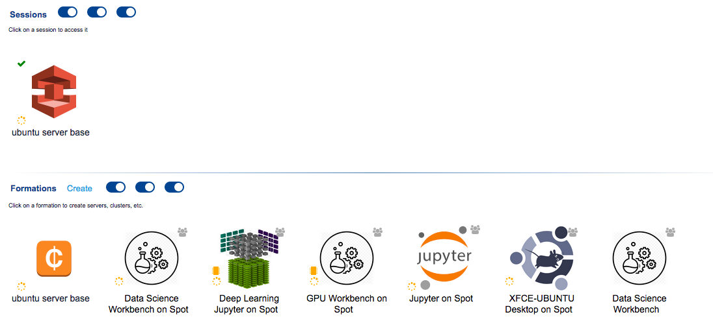
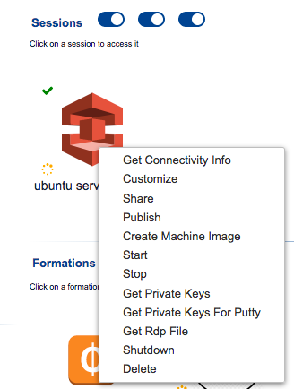
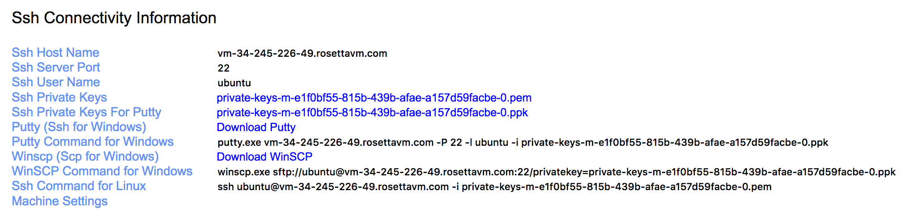

# Customizing images {#customizing-images}

<!--
1. launch ubuntu server (note on setting max spot price high; also increase disk size)
2. access ubuntu server
3. copy files using scp
4. setup ssmtp for e-mail alerts
5. install R
  - check version available in ubuntu repository
  - build R from source and install
6. install caret and any other R packages needed (doMC, RColorBrewer)
7. save running container as a new image
8. shutdown
9. relaunch and test everything is working


-->

## Introduction

We can customize any of the managed or semi-managed images provided on RosettaHUB, by installing additional software or making other configuration changes. The process is as follows:

1. launch a RosettaHUB machine
2. install additional software and/or make configuration changes
3. create a new image from the modified machine

In Docker terminology, we add a  [layer](https://docs.docker.com/glossary/?term=layer) to the base image.

For some projects we do not want the overhead of a graphical user interface and do not require all of the tools provided by the managed


To create a derived managed image, users have to launch a RosettaHUB machine then create an image from that machine on RosettaHUB. Managed images are configured with Docker containers. Docker containers contain applications for data science such as Pyhton, R, Rstudio, Scala, Sql and notebooks such as Jupyter and Zeppelin.

We can create derived images from any of these baseline images.

Explain example

## Launch machine
On Federation Console, go to Images section where you will see the following list:

Right click on Ubuntu Server 16.04 LTS and select 'Launch' from the context menu.

```{r customManagedImages, echo=FALSE, out.width='100%', fig.align='center', fig.cap="Managed images available"}
knitr::include_graphics("images/image_list_icons.png")
```

```{r customLaunchUbuntuServer, echo=FALSE, out.width='100%', fig.align='center', fig.cap="Launch ubuntu server"}
knitr::include_graphics("images/launch_ubuntu_server_2.png")
```

```{r customSessionsFormationsUbuntuServerBase, echo=FALSE, out.width='100%', fig.align='center', fig.cap="Ubuntu server container is listed under formations and sessions"}

```


## Connect to machine
```{r customUbuntuServerBaseContextMenu, echo=FALSE, out.width='50%', fig.align='center', fig.cap="Context menu for ubuntu server container"}

```

```{r customUbuntuServerBaseConnectivityInformation, echo=FALSE, out.width='100%', fig.align='center', fig.cap="Connectivity information for ubuntu server container"}

```


```
ls -la private-keys-m-e1f0bf55-815b-439b-afae-a157d59facbe-0.pem 
-rw-rw-rw-@ 1 matt  staff  1674 29 May 20:37 private-keys-m-e1f0bf55-815b-439b-afae-a157d59facbe-0.pem
```

```
chmod 600 private-keys-m-e1f0bf55-815b-439b-afae-a157d59facbe-0.pem
```

```
ssh ubuntu@vm-34-245-226-49.rosettavm.com -i private-keys-m-e1f0bf55-815b-439b-afae-a157d59facbe-0.pem
```

## Mount S3 storage

We will use the tool [s3fs](https://github.com/s3fs-fuse/s3fs-fuse). 

Install s3fs from ubuntu repository
```
sudo apt-get install s3fs
```

Find the **Access Key ID** and **Secret Access Key** for your default iamuser. They will appear like this:
**Access Key ID:** *X*
**Secret Access Key:** *X*


Create the /etc/passwd-s3fs file
```
sudo echo ACCESS_KEY_ID:Secret_Access_KEY_ID > /etc/passwd-s3fs
```

Save file, then set appropriate permissions
```
sudo chmod 640 /etc/passwd-s3fs
```

Create a mount point and mount S3 bucket
```
sudo mkdir -p /mnt/s3
sudo s3fs com-rosettahub-default-bioinfo1.cam /mnt/s3 -o passwd_file=/etc/passwd-s3fs
```

unmount
```
sudo umount /mnt/s3
```

edit /etc/fstab
```
LABEL=cloudimg-rootfs	/	 ext4	defaults,discard	0 0
s3fs#com-rosettahub-default-bioinfo1.cam /mnt/s3 fuse _netdev,allow_other 0 0
```


## Configure server to send e-mail

secure simple mail transfer protocol        

Update local package cache
```
sudo apt-get update
```

Install the ssmtp package
```
sudo apt-get install ssmtp
```

Setup ssmtp by editing the configuration file
```
sudo nano /etc/ssmtp/ssmtp.conf
```

Adjust and add as necessary to match the following parameters
Change "MyEmailAddress" and "MyPassword" to your own. 
```
# Config file for sSMTP sendmail
#
# The person who gets all mail for userids < 1000
# Make this empty to disable rewriting.
#root=postmaster
root=MyEmailAddress@gmail.com

# The place where the mail goes. The actual machine name is required no
# MX records are consulted. Commonly mailhosts are named mail.domain.com
#mailhub=mail
mailhub=smtp.gmail.com:587

AuthUser=MyEmailAddress@gmail.com
AuthPass=MyPassword
UseTLS=YES
UseSTARTTLS=YES

# Where will the mail seem to come from?
#rewriteDomain=
rewriteDomain=gmail.com

# The full hostname
#hostname=MyMediaServer.home
hostname=MyMediaServer.home

# Are users allowed to set their own From: address?
# YES - Allow the user to specify their own From: address
# NO - Use the system generated From: address
FromLineOverride=YES
```

Create aliases for local usernames (optional) by editing the  /etc/ssmtp/revaliases file
```
sudo nano /etc/ssmtp/revaliases
```

And add into it the desired translation which in our Gmail examples case will be
```
root:username@gmail.com:smtp.gmail.com:587
mainuser:username@gmail.com:smtp.gmail.com:587
```

From now on, the machine will Email when requested through command line or script.

Check setup by creating the a script to send an e-mail to yourself
```
nano send-alert.sh
```

```
#!/bin/sh
 
MAILFILE=/tmp/email_alert.txt
 
echo "Subject: RosettaHUB job completed!" > $MAILFILE
echo "To: mw283@cam.ac.uk" >> $MAILFILE
echo "From: from_who@from_where.com" >> $MAILFILE
 
echo "" >> $MAILFILE
echo "Test sent on $(date '+%Y/%m/%d at %H:%M:%S')." >> $MAILFILE
echo "" >> $MAILFILE
echo "Have a nice day!" >> $MAILFILE
 
cat $MAILFILE | ssmtp mw283@cam.ac.uk
 
rm $MAILFILE
```

Make script executable
```
chmod 700 send-alert.sh
```

Run script
```
./send-alert.sh
```

## Install R

Check which version of R is available in the ubuntu repository
```
apt-cache policy r-base-core
```

Version 3.2.3 is available, but the latest version of R is 3.5.0. Let's see if a more recent version of R is available from the official Comprehensive R Archive Network (CRAN) repository.

Open /etc/apt/sources.list and add the following line to the end of the file:

```
sudo nano /etc/apt/sources.list
```

```
deb http://cran.rstudio.com/bin/linux/ubuntu xenial/
```


Add the key ID for the CRAN network:
Ubuntu GPG key:
```
sudo apt-key adv --keyserver keyserver.ubuntu.com --recv-keys E084DAB9
```

Update the repository:
```
sudo apt update
```

Install the R binaries:
```
sudo apt install r-base
```


R on ubuntu server
