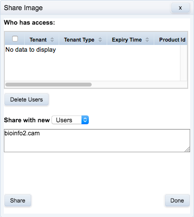
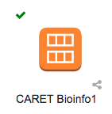
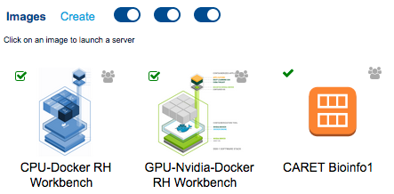

# Collaboration {#collaboration}

## Introduction
In chapter \@ref(containers) we saw how RosettaHUB's managed images facilitate real time collaboration. We have also seen how AWS Identity and Access Management (IAM) can be used to share storage in a controlled and secure manner (chapter \@ref(storage)). In this chapter we will look at sharing images, formations and containers. 


## Sharing images
Sharing images is easy. Right click on the machine image you would like to share, and select **share** from the pop-up menu:
```{r caretImageContextMenu, echo=FALSE, out.width='70%', fig.align='center', fig.cap="Image context menu"}
knitr::include_graphics("images/CARET_machine_image_context_menu.png")
```

Enter the user name of the person with whom you would like to share the image:
```{r shareImage1, echo=FALSE, out.width='100%', fig.align='center', fig.cap="Share image: add user"}

```

After clicking **share** the username will be added to the list of users with access to your image.
```{r shareImage2, echo=FALSE, out.width='100%', fig.align='center', fig.cap="Share image: user added"}
knitr::include_graphics("images/share_image2.png")
```

This is the appearance of the icon for the image on the owners console (note the grey symbol denoting sharing):
```{r sharedImageOwnersConsole, echo=FALSE, out.width='50%', fig.align='center', fig.cap="Appearance of shared image icon on the owners console."}

```

Here is the icon for the same image on the console of a user who has been granted access:
```{r sharedImageOthersConsole, echo=FALSE, out.width='100%', fig.align='center', fig.cap="Appearance of shared image on the other user's console."}

```

Try sharing the CARET machine image you created with your neighbour.

## Sharing formations and containers
Formations and containers (sessions in RosettaHUB terminology) can be shared in the same way as images. Try sharing a formation or container with your neighbour.
