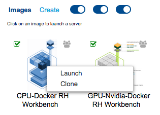
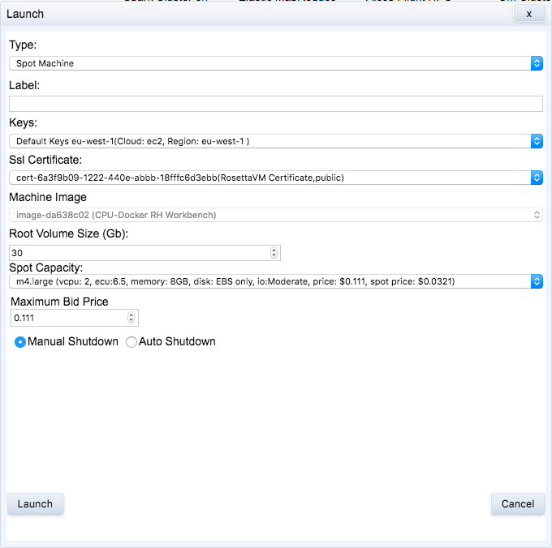
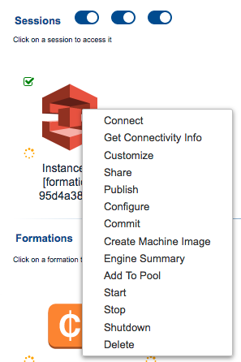
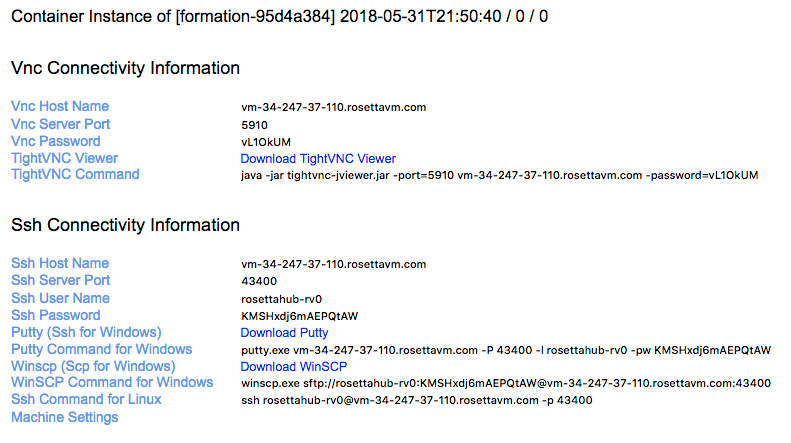

# Images and containers {#containers}

<!-- introduction to containers -->

## Definitions

**Docker images** are the basis of containers. An Image is an ordered collection of root filesystem changes and the corresponding execution parameters for use within a container runtime. An image typically contains a union of layered filesystems stacked on top of each other. An image does not have state and it never changes.

A **container** is a runtime instance of a docker image.

A Docker container consists of

* A Docker image
* An execution environment
* A standard set of instructions

The concept is borrowed from Shipping Containers, which define a standard to ship goods globally. Docker defines a standard to ship software.

## Images on RosettaHUB

RosettaHUB provides two types of [images](https://docs.rosettahub.com/display/management/Image):

* **Managed images:** These are images that are created and maintained by RosettaHUB or images that are derived from these images. RosettaHUB currently provides two managed images (CPU-Docker RH Workbench and GPU-Nvidia-Docker RH Workbench) which are equipped with a range of tools (Jupyter, Zeppelin, RStudio and RosettaHUB workbench) to facilitate data science and have a user friendly desktop environment.

* **Semi-managed images:** These are images that map AMIs on AWS that are not derived from RosettaHUB images. Semi-managed images allow users to easily launch a machine from the RosettaHUB web console using their RosettaHUB keys. Access to the instances is managed by RosettaHUB, ie RosettaHUB generates and saves the private keys associated with the machine and allows you to retrieve any time the credentials to connect your machine using RDP for Windows instances or Ssh for Linux instances.

## Launch a container

Available machine images are listed on the Federation Console. We will run a **CPU-Docker RH Workbench**. Right click on the icon for this image and select **Launch** from the menu:

(\#fig:rhImageMenu)Menu for managed image

The following dialog will appear. We will accept the default settings.

(\#fig:rhLaunch)Machine image launch dialog.

An icon for the container will appear in the **Sessions** section of the Federation Console. When the container is ready for use a green tick will appear in the top left corner of the icon. Right clicking on the icon will display a menu from which you should select **Get Connectivity Info**. 

(\#fig:rhContainerMenu)Container menu

A new tab will open displaying connection options for the container:

(\#fig:rhConnInfo)Container connectivity information

Try some of the above methods to connect to the container.

Return to the Federation Console and right click on the container icon once more. This time select **Connect**. You will be taken to the workbench interface of the container:

(\#fig:rhWorkbench)RosettaHUB container workbench

Explore the tools available on the workbench. When you have finished with the container, shut it down to conserve your AWS credits.

