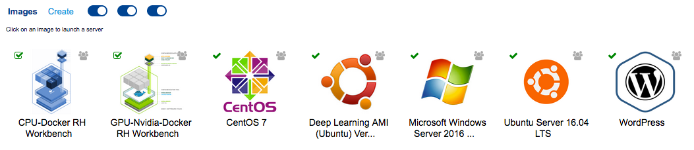
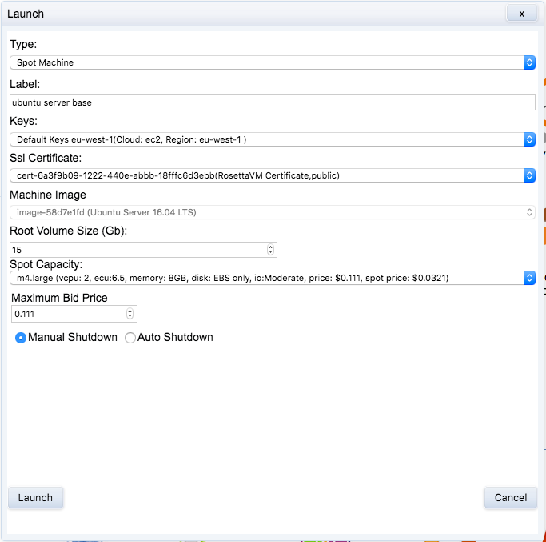

# Customizing images {#customizing-images}

<!--
1. launch ubuntu server (note on setting max spot price high; also increase disk size)
2. access ubuntu server
3. copy files using scp
4. setup ssmtp for e-mail alerts
5. install R
  - check version available in ubuntu repository
  - build R from source and install
6. install caret and any other R packages needed (doMC, RColorBrewer)
7. save running container as a new image
8. shutdown
9. relaunch and test everything is working


-->

## Introduction

We can customize any of the managed or semi-managed images provided on RosettaHUB, by installing additional software or making other configuration changes. The process is as follows:

1. launch a RosettaHUB machine
2. install additional software and/or make configuration changes
3. create a new image from the modified machine

In Docker terminology, we add a  [layer](https://docs.docker.com/glossary/?term=layer) to the base image.

For some projects we do not want the overhead of a graphical user interface and do not require all of the tools provided by the managed


To create a derived managed image, users have to launch a RosettaHUB machine then create an image from that machine on RosettaHUB. Managed images are configured with Docker containers. Docker containers contain applications for data science such as Pyhton, R, Rstudio, Scala, Sql and notebooks such as Jupyter and Zeppelin.

We can create derived images from any of these baseline images.

Explain example

## Launch machine
On Federation Console, go to Images section where you will see the following list:

Right click on Ubuntu Server 16.04 LTS and select 'Launch' from the context menu.

<div class="figure" style="text-align: center">

<p class="caption">(\#fig:customManagedImages)Managed images available</p>
</div>

<div class="figure" style="text-align: center">

<p class="caption">(\#fig:customLaunchUbuntuServer)Launch ubuntu server</p>
</div>

<div class="figure" style="text-align: center">

<p class="caption">(\#fig:customSessionsFormationsUbuntuServerBase)Ubuntu server container is listed under formations and sessions</p>
</div>


## Connect to machine
<div class="figure" style="text-align: center">

<p class="caption">(\#fig:customUbuntuServerBaseContextMenu)Context menu for ubuntu server container</p>
</div>

<div class="figure" style="text-align: center">

<p class="caption">(\#fig:customUbuntuServerBaseConnectivityInformation)Connectivity information for ubuntu server container</p>
</div>


```
ls -la private-keys-m-e1f0bf55-815b-439b-afae-a157d59facbe-0.pem 
-rw-rw-rw-@ 1 matt  staff  1674 29 May 20:37 private-keys-m-e1f0bf55-815b-439b-afae-a157d59facbe-0.pem
```

```
chmod 600 private-keys-m-e1f0bf55-815b-439b-afae-a157d59facbe-0.pem
```

```
ssh ubuntu@vm-34-245-226-49.rosettavm.com -i private-keys-m-e1f0bf55-815b-439b-afae-a157d59facbe-0.pem
```

## Configure server to send e-mail

secure simple mail transfer protocol        

Update ubuntu repository
```
sudo apt-get update
```

Install the ssmtp package
```
sudo apt-get install ssmtp
```

Setup ssmtp by editing the configuration file
```
sudo nano /etc/ssmtp/ssmtp.conf
```
