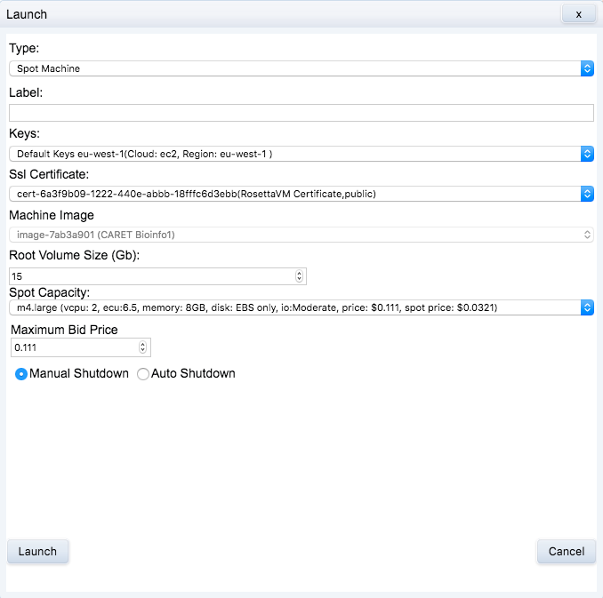
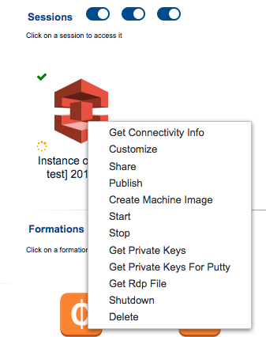

# Run data analysis {#run-analysis}
<!--
create results directory

ssh ubuntu@vm-34-245-95-14.rosettavm.com -i private-keys-m-cad2e4b8-770c-4574-b923-a3cfcece2da3-0.pem

scp -i private-keys-m-cad2e4b8-770c-4574-b923-a3cfcece2da3-0.pem ~/scripts/knn_classification_wheat_seeds.R ubuntu@vm-34-245-95-14.rosettavm.com:/home/ubuntu/

scp -i private-keys-m-cad2e4b8-770c-4574-b923-a3cfcece2da3-0.pem ~/git_repositories/big-data-cloud/scripts/knn_classification_wheat_seeds.R ubuntu@vm-34-245-95-14.rosettavm.com:/home/ubuntu/
-->

## Example problem
The seeds data set [https://archive.ics.uci.edu/ml/datasets/seeds](https://archive.ics.uci.edu/ml/datasets/seeds) contains morphological measurements on the kernels of three varieties of wheat: Kama, Rosa and Canadian. In this example we will attempt identify the variety of kernel from its morphological measurements using a k-nearest neighbours classifier. The details of the data-set and analysis are not important, we're simply using them to illustrate how to run a job in container. 

If you would like to take a look at the R script we will be using to run the analysis, you will find it on your workstation in the following location:
```
~/Course_Materials/scripts/knn_classification_wheat_seeds.R
```

## Launch machine
Start up a container from the machine image you created in the previous chapter. Right click on the icon for this image and select **Launch** from the menu that appears:
<div class="figure" style="text-align: center">

<p class="caption">(\#fig:analysisImageContextMenu)Image context menu</p>
</div>

You will be presented with a dialog box that allows you to choose some runtime settings for your container. You may want to specify a label for easy identification. 
<div class="figure" style="text-align: center">

<p class="caption">(\#fig:analysisContainerRuntimeSettings)Container runtime parameters</p>
</div>

Once your container is running its icon will appear in the **Sessions** section of the Federation console with a green check mark in the top left corner. Right click on the icon to bring up a menu, then click **Get Connectivity Info**:
<div class="figure" style="text-align: center">

<p class="caption">(\#fig:analysisIconRunningContainer)Icon of running container with menu</p>
</div>

The following connectivity information will be displayed. Download the **ssh private keys** as you will need them to connect to the container. 
<div class="figure" style="text-align: center">

<p class="caption">(\#fig:analysisConnectivityInformation)Container connectivity information</p>
</div>


## Copy script to container
Secure copy the R script to the container. Use a the syntax below, but remember to change the ssh private key filename and hostname to correct values for your container (refer to connectivity information obtained above):
```
scp -i private-keys-m-cad2e4b8-770c-4574-b923-a3cfcece2da3-0.pem ~/Course_Materials/scripts/knn_classification_wheat_seeds.R ubuntu@vm-34-245-95-14.rosettavm.com:/home/ubuntu/
```

## Run script
Create a results directory where your S3 bucket is mounted:
```
mkdir /mnt/s3/results
```

Make the script executable:
```
chmod 755 knn_classification_wheat_seeds.R
```

Run script:
```
./knn_classification_wheat_seeds.R
```

You should receive an e-mail notification when execution of the script finishes. 

You could try introducing syntax errors into the R script to test the error handling.

## Retrieve results files
If the container is running you can copy the directory of results files to your local workstation using scp, e.g.:
```
scp -i private-keys-m-cad2e4b8-770c-4574-b923-a3cfcece2da3-0.pem -r ubuntu@vm-34-245-95-14.rosettavm.com:/mnt/s3/results .
```

You can also copy the results files directly from your S3 bucket using the aws command line tools: 
```
aws s3 cp --recursive s3://com-rosettahub-course-bioinfo1.cam/results results
```

A third option would be to download your files directly from your S3 bucket using the AWS web interface.
